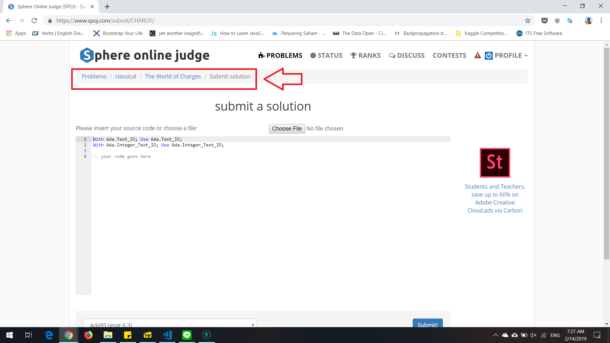
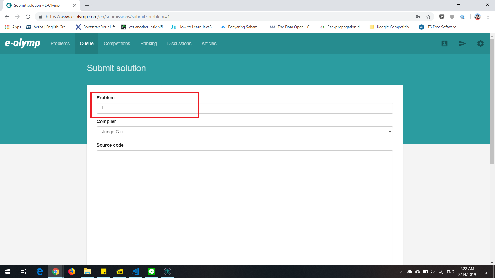

# Assignment 0

- Muhammad Aufa Wibowo
- 05111640000184
- IMK-A

## Critics to Some Bad Design
### 1. Stockbit.com

**Description:** Stockbit is an investment community in Indonesia. Stockbit provides space for investors and traders to share ideas, news and other financial information in real time. Users can create profiles and follow certain stocks or favorite investors to get valuable information and exchange ideas. The main feature of Stockbit is "stream" consisting of ideas, stock charts, links and other financial data. Stockbit uses the sign "$" before the stock code as a tagging idea to make it easier for users to find information about certain individual stocks. The Stockbit platform is also integrated with other social media platforms, such as Twitter and Facebook, making it easy to share ideas in the Stockbit to Twitter accounts and Facebook users. Stockbit is designed with focused features with the behavior of investors and traders so that it will be more useful as an investment-specific social media.

**Problem:** Stockbit has a good quality UI for user who want to give idea and scroll the timeline. Twitter for investors, basically. But, there is some flaw. For user who want to try stock trading simulation, I notice some 'imperfection' here. 

These are some need for investor to do basic things in stock trading system
  - Buy/Sell order
  - Check Portofolio

##### Buy/Sell Order
It's hard at first to figure out how to place an order to buy/sell stock. But, *intuitively* we would go to search bar and type the stock we want to search to do that. And tada!

##### Check Portofolio (the flaw)
And here is the problem. We got difficulties at first and second try. This video gonna explain a lot about that.

https://www.youtube.com/watch?v=biE3QZjR-wc

Well, it turns out that we need to click START TRADING button every time we logged in. And then we go to virtual account and we could check our portofolio. After that, stockbit automatically showed link to our portofolio. In another words, we need to go to virtual account first and stockbit would set your whole environment for virtual trading (I haven't try the real account though, so no comment on that). 

**Suggestion:** 
Since checking portofolio would be a frequent feature used by investors, I'd suggest to put the portofolio button in home page. So, after investors get logged in, they could easily check their portofolio.

### 2. Vivo User Interface
**Description:** Vivo Communication Technology Co. Ltd. is a Chinese technology company owned by BBK Electronics that makes smartphones, smartphone accessories, software, and online services. Just like any other chinese phone company, their product always try to mimick one of the flagship phone, iPhone and Samsung Galaxy. But it's iPhone mostly.

**Problem:** And here it comes the problem. Vivo try to mimick the old iPhone UI which is kinda sucks. The basic idea is, the designers try to put every configuration interface like brightness, volume, silent mode, bluetooth, gps and etc in one dock. It took some time to finally figure out how to pop the dock up (well, explicitly) and surprisingly there are bunch of icon control like bluetooth, gps, volume. It's not that bad actually(we know how to find that easily), but the problem is there is an old 70 year old grandmother who always stuck in operating smartphone. Good design should be for everyone right?

**Suggestion:** There are two perspective here. It's either UI designers need to design a specific UI only for older people (so they won't get stumble everytime). And/or make it more intuitive just like Apple iOS. Bigger button, bigger icon, and more bold.

**Video**
- https://youtu.be/oLoL9MuyAD8
- https://youtu.be/tzjvvgYrZC0

### 3. E-olymp.com
**Description:** E-Olymp is a website used for competitive programming challenge. There are many problems there and users could upload their soultion to the website and get some score (depends on the level of difficulties).

**Problem:** Compared to the same competition site SPOJ.com, I noticed a flaw here.  Before I go into that, I'd like to describe the steps required to perform upload solution.

##### SPOJ
These are the steps to submit a solution in SPOJ
- Log in
- Select the problem
- Press 'Submit Solution!' button in top corner right
- You're given a form by SPOJ, upload your solution
- Done

##### SPOJ
These are the steps to submit a solution in E-Olymp
- Log in
- Select the problem
- Go to 'Solutions' bar, just right after 'Statement' bar.
- Press 'Submit Solution' (well, +1 step here compared to SPOJ)
- You're given a form by E-olymp, upload your solution (don't forget to match your problem number, this is the flaw)
- Done

In SPOJ, user read the problem statement and solve only for the problem they just read (consistency). The problem in e-olymp is, you could accidently type any number in problem box and of course you would get wrong solution. Compared to SPOJ, after read the problem statement, there is possibility that user would submit another problem rather than the problem that currently they read now.

**Suggestion:** In my opinion, it would be better if e-olymp designs a solution page only for the problem user just read. (Just remove the problem number basically)

Thanks